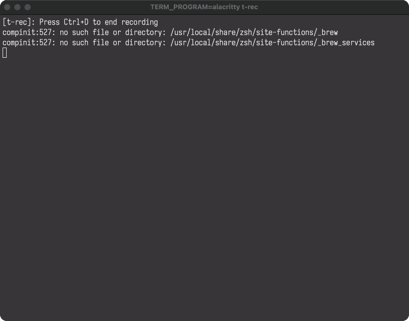

# Claude Code Hooks in Monorepos: Hook Router



> Each hook is defined in their respective subdirectory!

```
ui/.claude
├── scripts
│   └── prettier-hook.sh
└── settings.json
backend/.claude
├── scripts
│   └── ruff-hook.sh
└── settings.json
```

## The Problem

If you're using Claude Code in a monorepo, you've probably hit this wall: hooks only execute from the directory where you invoked Claude Code. Want to trigger `ui/` formatting hooks when working from the parent directory? Too bad. Claude Code only looks for hooks in `$CWD/.claude`, not in subdirectories.

This has been discussed in several GitHub issues:
- [anthropics/claude-code#456](https://github.com/anthropics/claude-code/issues/456) - "Monorepo support for hooks"
- [anthropics/claude-code#789](https://github.com/anthropics/claude-code/issues/789) - "Feature request: recursive hook discovery"

The root cause is simple: Claude Code's hook discovery is intentionally scoped to the invocation directory for security and predictability. It won't recursively search subdirectories.

## Why This Matters

In a typical monorepo structure like this:

```
monorepo/
├── ui/              # React app with prettier
│   └── .claude/
│       └── hooks/
├── backend/         # Python service with ruff
│   └── .claude/
│       └── hooks/
└── .claude/         # Parent directory
```

When you run Claude Code from the monorepo root, edits to `ui/src/App.jsx` won't trigger the prettier hook in `ui/.claude/hooks/`. Same for backend formatting. You end up with inconsistent formatting or having to remember to run Claude Code from each subdirectory separately.

This limitation makes it effectively untenable to run Claude Code with hooks from the parent monorepo directory at all—you lose the primary benefit of monorepo tooling (cross-cutting changes across multiple projects) because your development workflow forces you to work in isolated subdirectories.

## Some proposals

### Option 1: Work from subdirectories only
Just `cd ui/` before running Claude Code. Simple, but defeats the point of a monorepo. You lose the ability to make cross-cutting changes.

### Option 2: Duplicate hooks in parent directory
Copy all your hooks to the parent `.claude/hooks/` and add conditionals. Works until you forget to sync them. Now you have two sources of truth.

### Option 3: Parent hooks that manually dispatch
```json
{
  "hooks": {
    "PostToolUse": [{
      "matcher": "Write|Edit",
      "hooks": [
        {
          "type": "command",
          "command": "if [[ \"$CHANGED_FILE\" == backend/* ]]; then backend/.claude/hooks/format.sh; fi"
        },
        {
          "type": "command",
          "command": "if [[ \"$CHANGED_FILE\" == ui/* ]]; then ui/.claude/hooks/format.sh; fi"
        }
      ]
    }]
  }
}
```

This is closer, but you still have to manually update the parent config every time a subdirectory adds/removes/renames a hook. Fragile and doesn't scale.

## The Solution: Hook Router

Instead of hard coding hook paths, create a router that dynamically discovers and executes subdirectory hooks based on file paths.


This is also backwards compatible with running from the subproject directories.

### Implementation

**1. Create the router script** (`.claude/hooks/monorepo-router.sh`):

```bash
#!/bin/bash

# Monorepo Hook Router
# Automatically routes PostToolUse hooks to the appropriate subdirectory based on file path

PROJECT_DIR="${CLAUDE_PROJECT_DIR:-.}"

# Read the hook input JSON from stdin
INPUT=$(cat)

# Extract the file path from the JSON input
FILE_PATH=$(echo "$INPUT" | jq -r '.tool_input.file_path // empty')

# If no file path, exit silently
if [[ -z "$FILE_PATH" || "$FILE_PATH" == "null" ]]; then
  exit 0
fi

# Determine which subdirectory the file belongs to
if [[ "$FILE_PATH" == */backend/* ]]; then
  SUBDIR="backend"
elif [[ "$FILE_PATH" == */ui/* ]]; then
  SUBDIR="ui"
else
  # File is not in a managed subdirectory, exit silently
  exit 0
fi

# Check if subdirectory has a post-tool-use hook and execute it
HOOK_SCRIPT="$PROJECT_DIR/$SUBDIR/.claude/hooks/post-tool-use.sh"
if [[ -x "$HOOK_SCRIPT" ]]; then
  # Pass the JSON input to the subdirectory hook via stdin
  echo "$INPUT" | "$HOOK_SCRIPT"
fi
```

**2. Configure parent settings** (`.claude/settings.json`):

```json
{
  "hooks": {
    "PostToolUse": [
      {
        "matcher": "Write|Edit",
        "hooks": [
          {
            "type": "command",
            "command": "bash ./.claude/hooks/monorepo-router.sh"
          }
        ]
      }
    ]
  }
}
```

**3. Create subdirectory hooks** following the convention `<subdir>/.claude/hooks/post-tool-use.sh`:

```bash
# ui/.claude/hooks/post-tool-use.sh
#!/bin/bash
cd "$CLAUDE_PROJECT_DIR/ui" && cat | "$CLAUDE_PROJECT_DIR"/ui/.claude/scripts/prettier-hook.sh
```

```bash
# backend/.claude/hooks/post-tool-use.sh
#!/bin/bash
cd "$CLAUDE_PROJECT_DIR/backend" && cat | "$CLAUDE_PROJECT_DIR"/backend/.claude/scripts/post-edit-format.sh
```

**Important gotcha:** The `cd` is necessary because tools like `make` and `prettier` need to run from the correct working directory to find their config files (Makefile, .prettierrc, etc.).

### How It Works

1. Claude Code triggers the parent `PostToolUse` hook when you edit a file
2. The router reads the hook JSON from stdin (standard Claude Code hook interface)
3. It extracts the file path and pattern-matches to determine the subdirectory
4. If a matching `post-tool-use.sh` exists in that subdirectory, it pipes the JSON to it
5. The subdirectory hook can then call whatever formatters/linters it needs

### Why This Scales

**Adding a new subdirectory?** Easy:

1. Add an `elif` clause to the router (two lines)
2. Create `<subdir>/.claude/hooks/post-tool-use.sh`

**Changing a subdirectory hook?** Just edit that subdirectory's `post-tool-use.sh`. The parent config never needs updating.

**Want multiple hooks per subdirectory?** Your `post-tool-use.sh` can call multiple scripts:

```bash
#!/bin/bash
cd "$CLAUDE_PROJECT_DIR/backend"
cat | "$CLAUDE_PROJECT_DIR"/backend/.claude/scripts/format.sh
cat | "$CLAUDE_PROJECT_DIR"/backend/.claude/scripts/lint.sh
cat | "$CLAUDE_PROJECT_DIR"/backend/.claude/scripts/test.sh
```

Or better yet, have `post-tool-use.sh` dispatch to other scripts based on the hook data:

```bash
#!/bin/bash
cd "$CLAUDE_PROJECT_DIR/backend"

INPUT=$(cat)
TOOL_NAME=$(echo "$INPUT" | jq -r '.tool_name')

case "$TOOL_NAME" in
  Edit|Write)
    echo "$INPUT" | "$CLAUDE_PROJECT_DIR"/backend/.claude/scripts/format.sh
    ;;
  Bash)
    echo "$INPUT" | "$CLAUDE_PROJECT_DIR"/backend/.claude/scripts/security-check.sh
    ;;
esac
```

## The Tradeoff

The main tradeoff is the **static naming convention**: subdirectory hooks must be named `post-tool-use.sh` or whatever hook name you're referring to. If you have a subdirectory that wants to use a different name, you'll need to either:

1. Stick with the convention and have that script dispatch internally
2. Modify the router to support that subdirectory's custom naming

This is a deliberate tradeoff. Conventions reduce flexibility but eliminate configuration drift. In practice, having a standard entry point (`post-tool-use.sh`) that dispatches to project-specific scripts gives you the best of both worlds.

## Alternative: Could Claude Code Fix This?

Ideally, Claude Code would support something like:

```json
{
  "hooks": {
    "hookDiscoveryPaths": ["./ui/.claude", "./backend/.claude"],
    "PostToolUse": "..."
  }
}
```

But until that ships, the router pattern works great and is entirely user-land code.

## Conclusion

Hook routing solves the monorepo hook problem with minimal configuration and zero synchronization overhead. Each subdirectory owns its hooks, the parent provides routing, and you never have to remember to update both places.

The pattern is also applicable beyond Claude Code - any tool that needs directory-scoped configuration in a monorepo can benefit from this approach.

Full implementation: [see this repo's `.claude/` directory]

---
